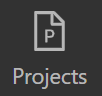
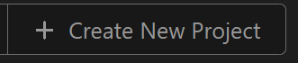
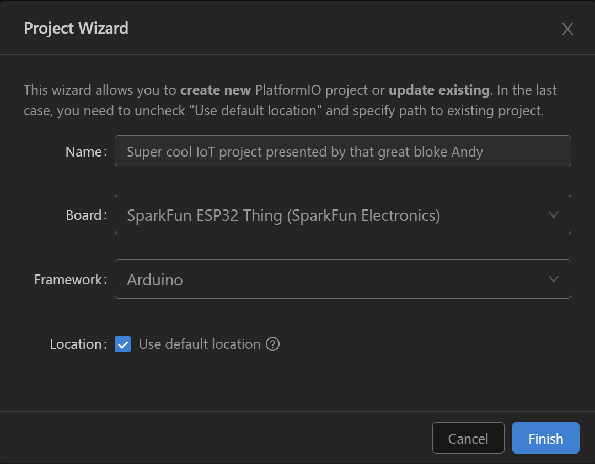
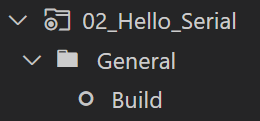
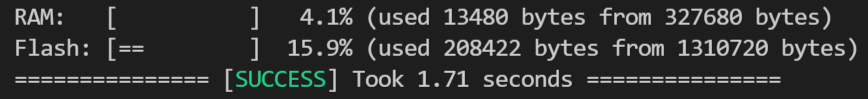

# Hello World
Lets get started with the microcontroller!!!

We are using an ESP32, a "System on Chip" microcontroller that has a massive laundry list of peripherals and features

Its claims to fame...
* relatively low power consumption
* Integrated Wi-Fi & Bluetooth
* A clock speed of 240MHz
* Priced around $4 at quantity

Its a relatively mature platform now, just a great general purpose microcontroller with a lot of community support around it.

You can also find it (or a close relative) integrated into a lot of different development boards:
* [M5 Stack](https://www.amazon.com/M5Stack-Core2-ESP32-Development-EduKit/dp/B08VGRZYJR/ref=sr_1_1_sspa?keywords=m5stack&qid=1637937449&sr=8-1-spons&psc=1&spLa=ZW5jcnlwdGVkUXVhbGlmaWVyPUEyRkZDTERQTEFFV1JCJmVuY3J5cHRlZElkPUEwOTE0MjM4M0pVNUlYVlpVM0VDRyZlbmNyeXB0ZWRBZElkPUEwMjIwNzY0M1A3TkZOV0pYQk5TSCZ3aWRnZXROYW1lPXNwX2F0ZiZhY3Rpb249Y2xpY2tSZWRpcmVjdCZkb05vdExvZ0NsaWNrPXRydWU=) - This one is Amazon certified & branded 
* [LoRa radio](https://www.aliexpress.com/item/32915894264.html?spm=a2g0o.productlist.0.0.2ac824a5u4zpm5&algo_pvid=eb672c2f-e768-47d4-bcad-0da946a66bcf&algo_exp_id=eb672c2f-e768-47d4-bcad-0da946a66bcf-1&pdp_ext_f=%7B%22sku_id%22%3A%2212000023374602426%22%7D) this device is intended for occupancy counting
* [5G Cellular](https://www.aliexpress.com/item/1005003202914314.html?spm=a2g0o.productlist.0.0.4bff245f1VBNXd&algo_pvid=809dee94-5b35-4dba-94c8-8e600f188831&algo_exp_id=809dee94-5b35-4dba-94c8-8e600f188831-1&pdp_ext_f=%7B%22sku_id%22%3A%2212000024640551264%22%7D) A potential low duty WiFi bridge
* [AI At the edge](https://core-electronics.com.au/maixduino-ai-development-board-ov2640-k210-risc-v-ai-lot-esp32.html) The ESP32 provides general IO & connectivity
* [Smart Watch](https://www.aliexpress.com/item/1005002053650442.html?spm=a2g0o.detail.1000023.8.76586033rEmbwp) for those who value hackability over fashion

# Today's Hardware
Today the lovely team behind [Latency](http://latencyconf.io) have provided everyone with their own development hardware that you get to take home at the end of the day!

We are working with the [LILYGO TTGO T-Display](https://www.aliexpress.com/item/33048962331.html?spm=a2g0o.productlist.0.0.49d0e146NxCi0O&algo_pvid=998b1fc5-7860-442b-83d9-f5fa6ca3f159&algo_exp_id=998b1fc5-7860-442b-83d9-f5fa6ca3f159-2&pdp_ext_f=%7B%22sku_id%22%3A%2212000015579521635%22%7D) it features:
* a 320x240 full colour OLED display
* USB-C connectivity
* USB-Serial converter
* Several buttons
* LiPo circuitry
* 16MB of flash

# Starting a new project

We're going to start a new project with Platform IO home screen. Open the *Quick Access* panel to the left of your VSCode window and select `Projects & COnfiguration`


Or use the command pallet via `[ctrl]+[Shift]+[P]` on windows and select `PlatformIO: Home`.
Then navigate to  `Projects` via the button to the left 

 

From the projects screen select `create new project`



## Board Wizard
The board wizard is a blessing and a curse. It has over 1000 of the most common boards, but there are many other variants not listed, especially from chinese companies. Most development boards from popular manufacturers like [Adafruit](https://adafruit.com), [Sparkfun](https://sparkfun.com), [Arduino](https://arduino.com) are available...... 

Unfortunately the bord for today is not! So we're going to use a substitute that is similar in all of the ways that matter.

### Parameters:
| Field | Setting |
---|---
Name | <whatever makess sense to you\>
Board | ESP32 Thing
Framework | Arduino
Location | [x] Default

### Screenshot:




# File Structure
You should now have a new VSCode window open with a file structure that looks something like this...
```
|-.pio\
|-.vscode\
|-include\
|-lib\
|-resources\
|-src\
|-test\
|-.gitignore
|-platformio.ini
```
we are going to be working with the `src` folder and `platformio.ini` for the rest of this workshop (who needs testing anyway).

# main.cpp
Our main file is the heart of our porgram and looks pretty plain to begin with

```
#include <arduino.h>

void setup(){

}

void loop(){

}
```

The arduino library significantly simplifies working with micro controllers. Providing a broad range of functions and interoperability across the ecosystem. 

*be aware, Arduino code has an LGPL license and may present problems in commercial applications*

## hello...?
Lets make sure we can communicate with our micro controller. Writing a program to the non volatile memory of a microcontroller is called *"flashing"* 

So lets build and upload our empty project and overwrite the demo code on the development board.

Open the Platform IO menu via the sidebar icon and select `build` under the `general` folder.



If everything went well, you should see a terminal output that describes the memory utilisation and a big green `success` 




# Platformio.ini
This is the magic file that enables platformio to work its magic. Similar to `requirements.txt` or `package.json`. A [TOML](https://toml.io/en/) document, the parameters we modify and define here affect how our code compiles and the libraries that are included.

