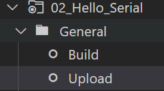
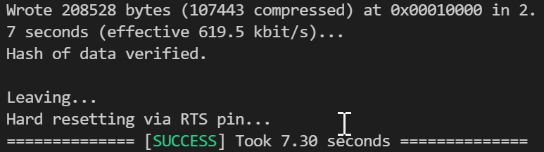
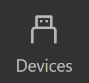
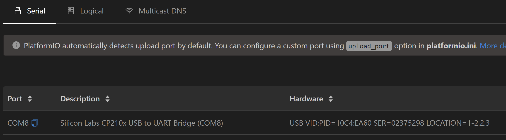

# Hello World
Lets get started with the microcontroller!!!

We are using an ESP32, a "System on Chip" microcontroller that has a massive laundry list of peripherals and features

Its claims to fame...
* relatively low power consumption
* Integrated Wi-Fi & Bluetooth
* A clock speed of 240MHz
* Priced around $4 at quantity

Its a relatively mature platform now, just a great general purpose microcontroller with a lot of community support around it.

You can also find it (or a close relative) integrated into a lot of different development boards:
* [M5 Stack](https://www.amazon.com/M5Stack-Core2-ESP32-Development-EduKit/dp/B08VGRZYJR/ref=sr_1_1_sspa?keywords=m5stack&qid=1637937449&sr=8-1-spons&psc=1&spLa=ZW5jcnlwdGVkUXVhbGlmaWVyPUEyRkZDTERQTEFFV1JCJmVuY3J5cHRlZElkPUEwOTE0MjM4M0pVNUlYVlpVM0VDRyZlbmNyeXB0ZWRBZElkPUEwMjIwNzY0M1A3TkZOV0pYQk5TSCZ3aWRnZXROYW1lPXNwX2F0ZiZhY3Rpb249Y2xpY2tSZWRpcmVjdCZkb05vdExvZ0NsaWNrPXRydWU=) - This one is Amazon certified & branded 
* [LoRa radio](https://www.aliexpress.com/item/32915894264.html?spm=a2g0o.productlist.0.0.2ac824a5u4zpm5&algo_pvid=eb672c2f-e768-47d4-bcad-0da946a66bcf&algo_exp_id=eb672c2f-e768-47d4-bcad-0da946a66bcf-1&pdp_ext_f=%7B%22sku_id%22%3A%2212000023374602426%22%7D) this device is intended for occupancy counting
* [5G Cellular](https://www.aliexpress.com/item/1005003202914314.html?spm=a2g0o.productlist.0.0.4bff245f1VBNXd&algo_pvid=809dee94-5b35-4dba-94c8-8e600f188831&algo_exp_id=809dee94-5b35-4dba-94c8-8e600f188831-1&pdp_ext_f=%7B%22sku_id%22%3A%2212000024640551264%22%7D) A potential low duty WiFi bridge
* [AI At the edge](https://core-electronics.com.au/maixduino-ai-development-board-ov2640-k210-risc-v-ai-lot-esp32.html) The ESP32 provides general IO & connectivity
* [Smart Watch](https://www.aliexpress.com/item/1005002053650442.html?spm=a2g0o.detail.1000023.8.76586033rEmbwp) for those who value hackability over fashion

# Today's Hardware
Today the lovely team behind [Latency](http://latencyconf.io) have provided everyone with their own development hardware that you get to take home at the end of the day!

We are working with the [LILYGO TTGO T-Display](https://www.aliexpress.com/item/33048962331.html?spm=a2g0o.productlist.0.0.49d0e146NxCi0O&algo_pvid=998b1fc5-7860-442b-83d9-f5fa6ca3f159&algo_exp_id=998b1fc5-7860-442b-83d9-f5fa6ca3f159-2&pdp_ext_f=%7B%22sku_id%22%3A%2212000015579521635%22%7D) it features:
* a 320x240 full colour OLED display
* USB-C connectivity
* USB-Serial converter
* Several buttons
* LiPo circuitry
* 16MB of flash

# Starting a new project

We're going to start a new project with Platform IO home screen. Open the *Quick Access* panel to the left of your VSCode window and select `Projects & COnfiguration`


Or use the command pallet via `[ctrl]+[Shift]+[P]` on windows and select `PlatformIO: Home`.
Then navigate to  `Projects` via the button to the left 

 

From the projects screen select `create new project`


## Board Wizard
The board wizard is a blessing and a curse. It has over 1000 of the most common boards. Most development boards from popular manufacturers like [Adafruit](https://adafruit.com), [Sparkfun](https://sparkfun.com), [Arduino](https://arduino.com) are available, but there are many other variants not listed, especially from chinese companies 

Unfortunately the bord for today is not included! So we're going to use a substitute that is similar in all of the ways that matter.

### Parameters:
| Field | Setting |
---|---
Name | <whatever makess sense to you\>
Board | ESP32 Thing
Framework | Arduino
Location | [x] Default

### Screenshot:


# File Structure
You should now have a new VSCode window open with a file structure that looks something like this...
```
|- .pio\
|- .vscode\
|- include\
|- lib\
|- resources\
|- src\
|--- main.cpp
|- test\
|- .gitignore
|- platformio.ini
```
we are going to be working with the `src` folder and `platformio.ini` for the rest of this workshop (who needs testing anyway).

# main.cpp
Our main file is the heart of our porgram and looks pretty plain to begin with

```cpp
#include <arduino.h>

void setup(){

}

void loop(){

}
```

The arduino library simplifies working with micro controllers. Providing a broad range of functions and interoperability across a number of microcontroller products. 

*be aware, Arduino libraries have a LGPL license and may present problems in commercial applications*

Code is executed in two phases. 

1. Initialisation and configuration code that only needs to be executed once is included in the `Setup` subroutine and is executed first

Then... 

2. All code within the `loop` subroutine is repeated until the end of time (or the batteries run flat) 

## hello...?
Lets make sure we can communicate with our micro controller. Writing a program to the non volatile memory of a microcontroller is called *"flashing"* 

So lets build and upload our empty project and overwrite the demo code on the development board.

Open the Platform IO menu via the sidebar icon and select `build` under the `general` folder.


If everything went well, you should see a terminal output that describes the memory utilisation and a big green `success` 


With the boilerplate code compiling, lets try to upload it to our device. Within the *Project Tasks* menu, select `Upload`



Now you can watch characters zip across the terminal again...





<p align="center" style="margin-top:30px; margin-bottom:30px">

</p>

# Serial, no longer just for breakfast
Some cloud native whipper snappers may have never experienced a serial port before. Others may have remembered them as funny little 9 pin cables that connected to their dial up modem.

Serial ports are ubiquitous with micro controllers and enable us to flash programs and interact with code running on the hardware. Our development board has a USB to Serial converter built in and Platform IO will automatically identify the `virtual com port` 

## Com port identification (optional)
You can confirm the presence of your COM port via the `devices` tab on the `PIO Home` page. 



All available com ports will be listed. More advanced applications that use Over the Air \[OTA] updates can be configured here 



## Adding Serial to our project
We will use the Serial port to monitor the state of our program and make sure it is doing what we expect. 

To enable this we must instruct the micro to initialise the interface and the speed to communicate at

```cpp
void setup(){
    Serial.begin(115200);

    // Lets also give it something to say
    Serial.println("Hello World");
}
```

Done!

Now lets flash the board again, but this time we want to `monitor` the serial port output as well. By now you've probably seen the `Upload and Monitor` button in the Project tasks panel. This button will:
1. Compile (build) your program
2. Upload it to the micro
3. Open a serial terminal after upload to monitor the output

Essentially it does everything we need in one click. Press the button and lets flash our new code!
<p align="center" style="margin-top:30px; margin-bottom:30px">
</p>

### Gibberish?
Got some funky characters? You've fallen right into my trap...

# Platformio.ini
This is the magic file that enables platformio to work its wonders. Similar to `requirements.txt` in python or `package.json` with node. This `.ini` file is a  [TOML](https://toml.io/en/) formatted document, the parameters we modify and define here affect how our code compiles and the libraries that are included.

By default, the monitor opens the serial port with a baud rate of 9600. To match the ESP32 bootloaders native speed, we should set this to 115200 as well. 

Edit your `platformio.ini` file to include the line `monitor_speed = 115200`

Flash it again and see if you're still playing the hardware equivalent of the game 'telephone'.

# Buttons!
Lets add some interactivity now. Our development board has two larger white buttons. We can use these to interact with the device and change the output on the serial port. 

### Definitions
First we need to define which physical input pins on the microcontroller these buttons are connected to. Often you can find this in schematics, datasheets or product descriptions. We are making it easy today and just telling you, add the following pin defintions to the top of the file.

```cpp
#include <Arduino.h>

// Define simple names for the hardware buttons
// 1 - Easier to remember
// 2 - If we change the connection in the future we only need to make one change in the code
const char BUTTON_0 = 0;
const char BUTTON_1 = 35;
```
### Configuration
We also need to configure the micro controller so that it can structure the internal circuitry to read these as inputs. We only need to tell the microcontroller to do this once, so this is part of the `setup` routine.
```cpp
// Configure the IO pins as inputs
    // Inputs cannot "float" they need an anchor
    // This is in the form of a pull up resistor built into the chip that we can enable 
    pinMode(BUTTON_0, INPUT_PULLUP);
    pinMode(BUTTON_1, INPUT_PULLUP);
```
### Reading
Finally we can do something with these buttons in the *main loop* of our program. Lets read their values and output a message to the serial port when they are pressed.
```cpp
{
    Serial.println("loop");
    // read the digital input BUTTON_0
    if(digitalRead(BUTTON_0) == false){
        Serial.println("Button 0 is pressed");
    }

    // read the digital input BUTTON_1
    if (digitalRead(BUTTON_1) == false){
        Serial.println("Button 1 is pressed");
    }
    
    // wait a second before repeating the loop
    sleep(1);
}
```
What do you see on the monitor when you flash these changes?

# Success!
You've now programmed a micro controller and used it to interact with some physical buttons.
<p align="center" style="margin-top:30px; margin-bottom:30px">
</p>

Some additional notes are available in the `Completed_Code` section as well. Lets do something with that display next!