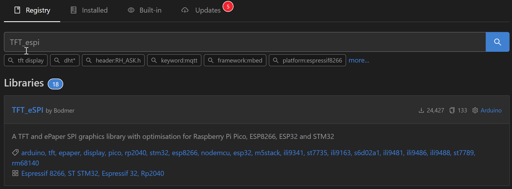
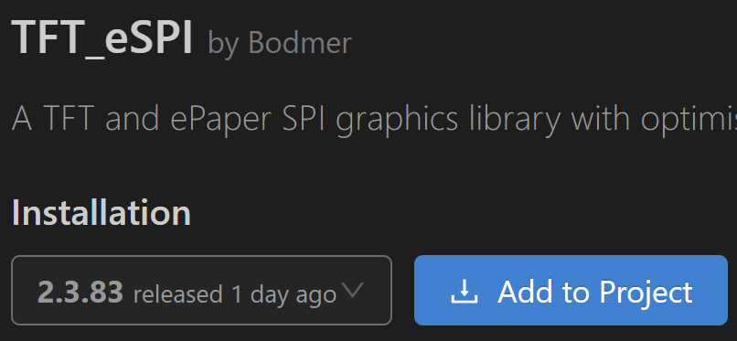
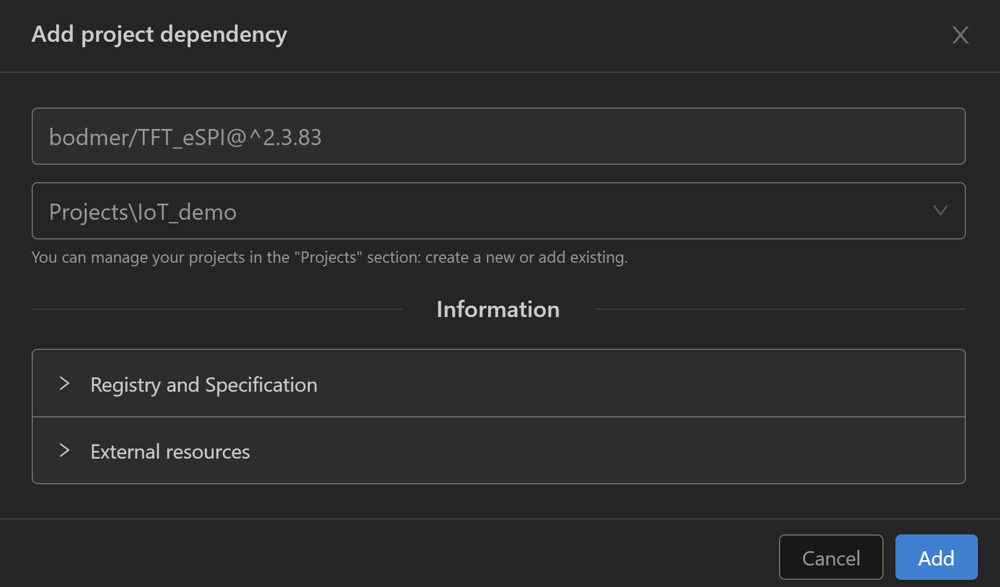
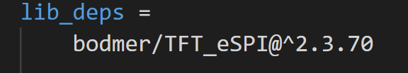

# Hello Display
The most obvious thing about our development board is the OLED display taking up one side. Lets get that working!

# Library management
Platform IO has integrated support for installing libraries and their dependancies. There are two techniques to skin this poor cat:
1. Add the library to the `platformio.ini` file
2. Use the library browser to add the file

Option 1 is particularly useful if you're wanting to include a library from a previous project. Whilst option 2 is great if you know vaguely what you want but want to explore features and examples.

## point, click, install
Open *platform IO home* once again. Now we're looking at the libraries tab!

To bring our display to life we are going to use the `TFT_eSPI` library. Including it is as simple as searching for it and adding it in your project. 

*Sometimes it can be useful to find libraries related to specific components in your design. If you're looking for a specific library you may want to double check the author to ensure you select the right one.*

Search for the display library, it should be your first result


When you have checked the author name matches as well, add the library to your project



The PlatformIO window doesn't assume you mean the active project and will need you to select it from a drop down menu



## definition method
You can now see a new heading in the `platformio.ini` file, `libdeps`. No points are awarded for deciphering that these are library dependancies for the project. If you clone a platform io project, platformio will retrieve the library from the libraries native repository. This may not seem a big deal for those accustomed to package managers but its a big (and long overdue) step for embedded hardware development.



# Configuring the library
We need to tell platformio how to configure our library and ensure the microcontroller can connect to the display.

For those who have worked with microcontrollers before, these pin defintions were often done in a header file. Now these definitions are better defined in the `platformio.ini`.

This library in particular makes it easy to get started with our display. All of the pins and speed settings are already defined in a custom header file. So we simply add the following to our `platformio.ini` file and we can talk to our display

```
build_flags = 
	-D USER_SETUP_LOADED=1
	-include $PROJECT_LIBDEPS_DIR/$PIOENV/TFT_eSPI/User_Setups/Setup25_TTGO_T_Display.h
```

Next, lets include the library within our `main.c` file. Along with an instance of the tft object.
```
#include <arduino.h>
// Include the TFT display library
#include <TFT_eSPI.h>

// display library instance
TFT_eSPI tft = TFT_eSPI();
```

# Configuring the microcontroller
Now we need to initalise our display in the code! Then we can start writing text to our display and not just the serial port.

Lets initalise the parameters of our display in `setup()`

```Cpp

    Serial.print("Initialise LCD");
  
    // Start communication
    tft.init();
    // Orientate the display
    tft.setRotation(3);

    tft.fillScreen(TFT_WHITE);

    // Set the X, Y position, and font style 
    tft.setCursor(0, 0, 2);
    tft.setTextSize(2);
    tft.setTextColor(TFT_RED);
    tft.println(" Hello World ");
    sleep(3);

```
Flash your microcontroller with the new code and watch it priting its first character.

<p align="center" style="margin-top:30px; margin-bottom:30px">
</p>

# User Feedback
So we have a display and its super friendly, what else can we use it for? Lets create a simple counter with our buttons.

To store the counter state we must initalise a variable. Global values are more common in microcontrollers thanks to the infinite loop and no file system. This means parameters and state information are (generally) kept in RAM and defined as globals so they are not constantly reinitialised.

Lets define a global variable for a counter, just above the main loop.

```cpp
int counter = 0;

void loop(){
```
<p align="center" style="margin-top:30px; margin-bottom:30px">
</p>

Now that we feel a little unclean, lets make use of this variable in our main *loop* by displaying it on our shiny new screen!

```cpp
  // This graphic library is very lightweight
  // There is no DOM, or layers or contextual smarts.
  // It sets pixel values and that is it!
  // This means pixels must be cleared when numbers change 
  tft.fillScreen(TFT_LIGHTGREY);

  // The cursor must be returned back to the start of the screen too
  // X, Y, font style are set with a single command
  tft.setCursor(10,10,1);

  // We also want to make the text more legible
  // This code could also be moved to 'setup()' 
  tft.setTextSize(3);

  // Update the LCD with the counter value
  // The library will automatically interpret the integer value and convert it to a string
  tft.println(counter);
```

You know what to do next...

<p align="center" style="margin-top:30px; margin-bottom:30px">
</p>

# Dont be a zero
Ok so our counter doesn't really 'count' anything at the moment. So lets add some code to the `if` statements we created previously.

```cpp
  if(digitalRead(BUTTON_0) == false){
    Serial.println("Button 0 is pressed");
    // Increment the counter
    counter++;
  }

  // read the digital input BUTTON_1
  if (digitalRead(BUTTON_1) == false){
      Serial.println("Button 1 is pressed");
      //decrement the counter
      counter--;
  }
```
thats it! Two simple lines of code and we have an interactive display.

## taking it further
VSCode has some nice code completion tools. See what other display colours are possible. 

Can you adjust the timing loop? Does sleep still work well for this? Maybe `delay()` is a better option.

What about that flicker, can it be removed so that its only needed when the numbers change?

When you're ready to move on, lets connect this $20 piece of fibreglass and silicone to... THE INTERNET!!!

<p align="center" style="margin-top:30px; margin-bottom:30px">
</p>
