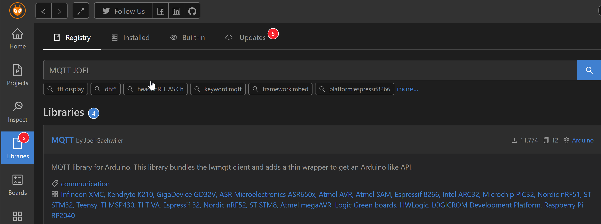
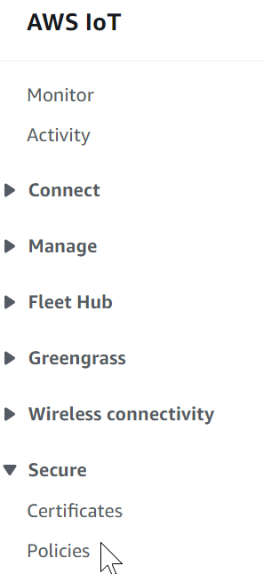
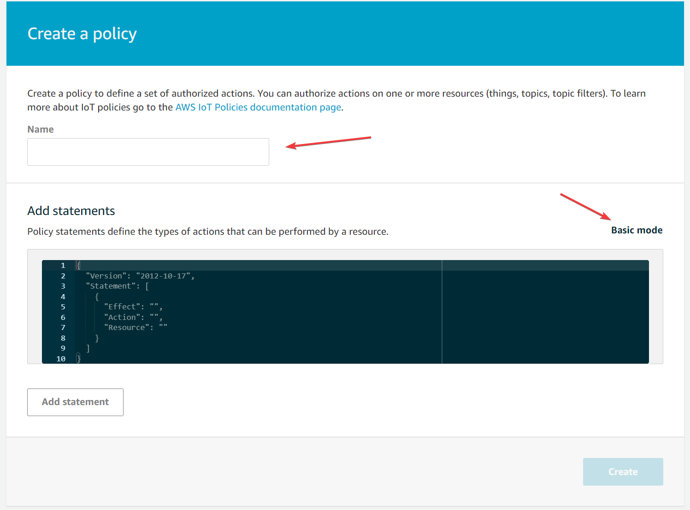
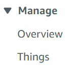
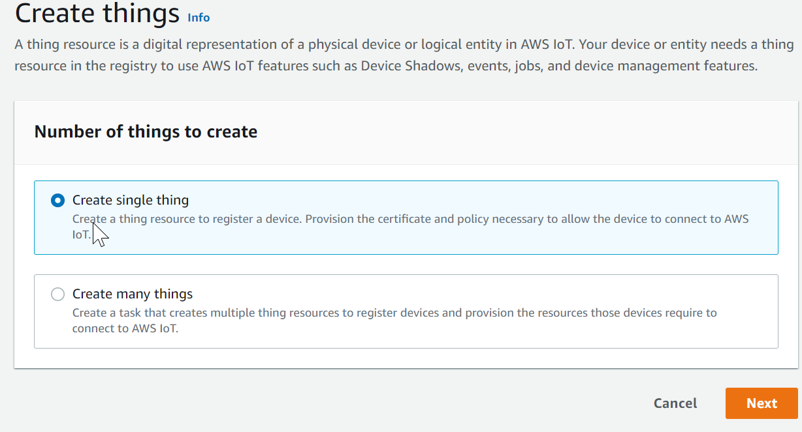
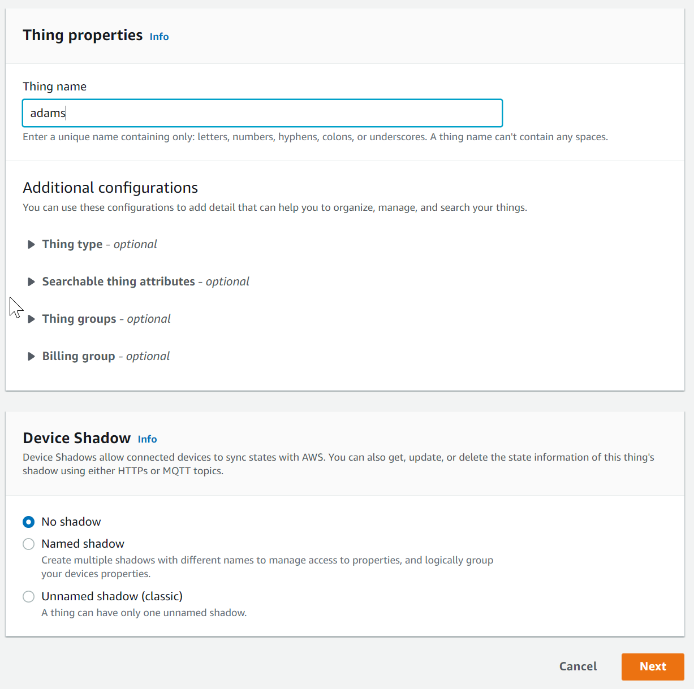
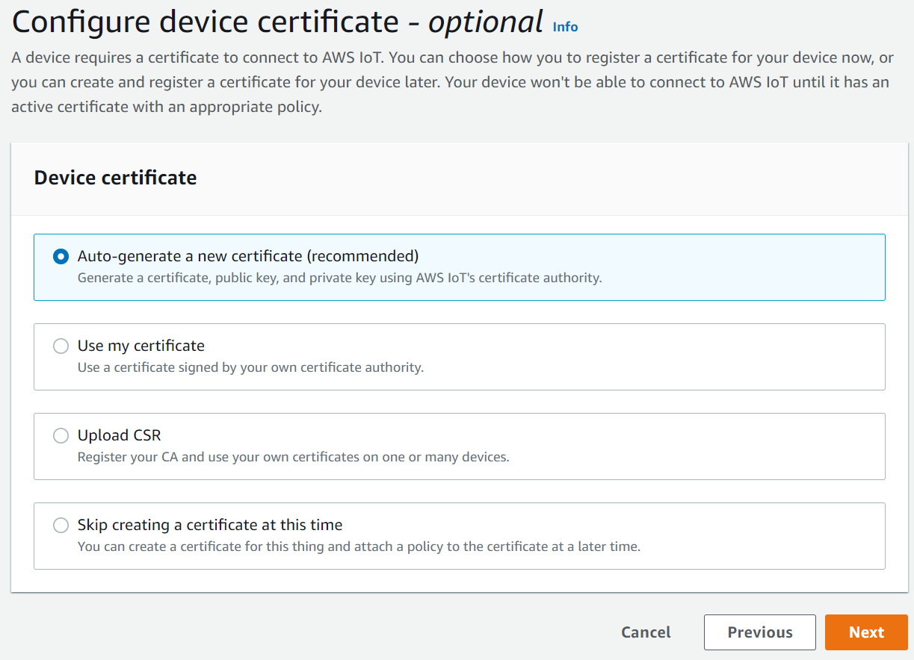
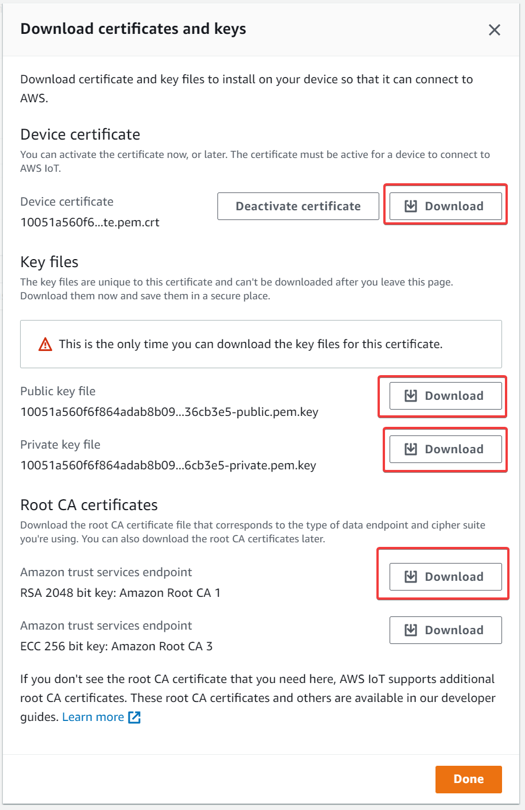
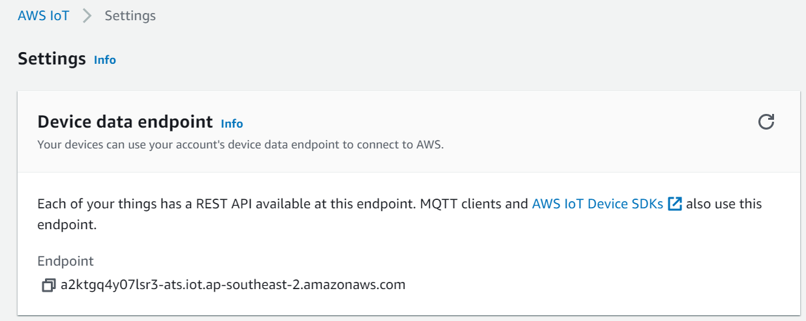

# Hello AWS
Hold onto your bonnet, this is where we start to make our *Internet Thing* more than a fancy counter with the potential to become part of a Bot Net.

<p align="center" style="margin-top:30px; margin-bottom:30px">
</p>

# IoT Core & MQTT
We are going to connect our micro controller to the cloud and we are going to use AWS IoT Core to secure and manage the connection. 

The AWS IoT Core service by Amazon allows us to create discrete 'things' and communicate back and forth between themselves, the cloud and each other. It also includes a bunch of other services like fleet management, Over the Air updates, message forwarding, security processes and thing shadows (JSON formatted state documents) but today we are going to focus on the basics.

## MQTT
MQTT is a protocol that typically runs on top to TCP/IP. Data is transfered from publishers to subscribers via a *broker*. AWS IoT Core is an MQTT broker and our *Things* (as well as other AWS resources) are clients. This makes it an efficient and light weight system for event driven architectures, especially for distributed systems.

### Hot Topics
Clients will subscribe and publish to topics. Basically just a string of characters that can be segregated like a file path. Things get interesting when wild cards are utilised by subscribers to recieve messages from multiple similar topics. Today we are going to deal with simple topic formats, however we will use the `#` wildcard as a shortcut when troubleshooting on the AWS Console

### Quality of Service
MQTT also has 3 native Quality Of Service \[QOS] that dictate how messages are sent.
* 0 – not more than once
* 1 – at least once
* 2 – exactly once
AWS IoT core only supports QOS levels 0 and 1 ! This is partially due to the overhead of providing a scalable serverless broker and secondly because many features of QOS 2 are better handled by thing shadows.

# Libraries
First step, install the libraries via the platformio manager.

## MQTT
Ensure when you install the package that you have selected the library by Joel Gaehwiler



## JSON
The ArduinoJSON library also helps to reduce a lot of headaches when it comes to working with complicated Strings in C.

Ensure you install the library by *bblanchon*

## Includes
Now include the following library declarations in your `main.c` file
```cpp
// Add the secure WiFi and MQTT libraries
#include <WiFiClientSecure.h>
#include <MQTTClient.h>
#include <ArduinoJson.h>
```

# Cloudy
Now we get into the Amazon part. Open your AWS Console and navigate to `IoT Core`. We're going to perform a number of key actions here:
* Create a policy
* Create a 'thing'
* Download certificates
* Identify the end point

## Policy
As with all other AWS resources, policies manage the actions that a system or service can perform. *Things* have a seperate policy system external to traditional *IAM* policy tools. Today we are going to use a very broad policy so we can get moving quickly and avoid traps in the limited time available. You should always consider reducing the scope of policies to provide the minimum ammount of privledges provided, other samples are provided in the complete solution code.

Within the AWS IoT service, navigate to `Secure > Polcies`


Create a new policy


Add a name, something like `MassiveAttackSurface` 



and switch the `advanced mode` so you can copy and past the policy in from below

```json
{
    "Version": "2012-10-17",
    "Statement": [
      {
        "Effect": "Allow",
        "Action": "iot:*",
        "Resource": "*"
      }
    ]
}
```

## Things
Now we finally get to put the 'Thing' into our message box

https://media.giphy.com/media/dlNZijbfZjUv6/giphy.gif

Jump up the menu to `Manage > Things` and open it



Create a  single thing




Give the thing a name. No other settings need to be changed, we are not going to be using shadows in this example.



Auto generate certificate files



Select the policy you just created

Download all of the certificates. This is your only chance to download the certificates for this thing, make sure you download them somewhere secure.



Thats it, we've created all of the resources we need in the console for our thing

# More Secrets than the CIA

We're going to be building out the `secrets.h` file with our new certificates. First we need to `#include <pgmspace.h>` at the top of the file. We then need to copy the certificates into char arrays. 

The `secrets.h` sample file has the correct format. Ensure that all characters and new lines are preserved when copying your keys/certs into the file. 

You also need to update the `AWS_IOT_ENDPOINT` variable with the url for your AWS IoT core endpoint! This can be found at the top of the AWS IoT Settings page




# Integration
Now we can bring it all together and connect to AWS using our certificates.

First we instantiate our secure networking connection and MQTT client
```cpp
// Secure WiFi and MQTT client instances
WiFiClientSecure net = WiFiClientSecure();
MQTTClient client = MQTTClient(1024);
```

Then in `setup()` we initalise the connection
```cpp
  Serial.println("Connecting to AWS");
  // Configure WiFiClientSecure to use the AWS IoT device credentials
  net.setCACert(AWS_CERT_CA);
  net.setCertificate(AWS_CERT_CRT);
  net.setPrivateKey(AWS_CERT_PRIVATE);

  // Start the MQTT client 
  client.begin(AWS_IOT_ENDPOINT, 8883, net);

  while (!client.connect(CLIENT_NAME)) {
    Serial.print(".");
    delay(100);
  }

  if(!client.connected()){
    Serial.println("AWS IoT Timeout! :(");
    while(1);
  }
  else{
    Serial.println("AWS IoT Connected! :D");
  }
```

Flash your code and if everything lines up and your blood sacrifice was accepted, you should now be connected to the AWS IoT Core Broker!!!

# Hello
A static connection isn't very exciting though, lets send something to AWS. Why not share out counter with any other service or client on our AWS account that wants to subscribe?

## Publisher
We've been working in two subroutines for a while, now we need to breakout and create a new one. This is a simple publisher that creates a JSON document and publishes a number and if it was incrementing or decrementing from the previous count.

```cpp
void publish(int count, String action ){
  // Define a new ArduinoJSON document object
  // Arguably not the most efficient use of memory resources
  //   but a very efficient use of developer time!
  StaticJsonDocument<200> doc;

  // Add records to the JSON Doc
  doc["count"] = count;
  doc["action"] = action;

  // Create a char buffer
  char jsonBuffer[512];
  // Generate the JSON object and store it in the char buffer
  serializeJson(doc, jsonBuffer);

  Serial.print("JSON Object: ");
  Serial.println(jsonBuffer);

  client.publish("counter", jsonBuffer);

  
}
```

What about our main loop!? That just needs two new function calls

```cpp
  if(digitalRead(BUTTON_0) == false){
    Serial.println("Button 0 is pressed");
    counter++;
    publish(counter, "increment");
  }

  if (digitalRead(BUTTON_1) == false){
      Serial.println("Button 1 is pressed");
      counter--;
      publish(counter, "decrement");
  }
```

# Monitor your activity
So now we are publishing data, how can we tell if it is getting there? 

The boffins at AWS have alreadt thought of that. There is an MQTT client in the console that allows developers to subscribe and publish to topics. You can find this by selecting `test` from the menu.

To catch all traffic flowing through our broker we can subscribe to a topic using the wildcard `#`. If a message passes through our broker, we will see it in our web console!

Are your messages getting through? 

How could you change the topic structure to provide better filtering options? 

Is there other information you could include in your payload?

Communication is feeling a bit one sided though. Lets get our microcontrollers to subscribe to a topic.

<p align="center" style="margin-top:30px; margin-bottom:30px">
</p>
