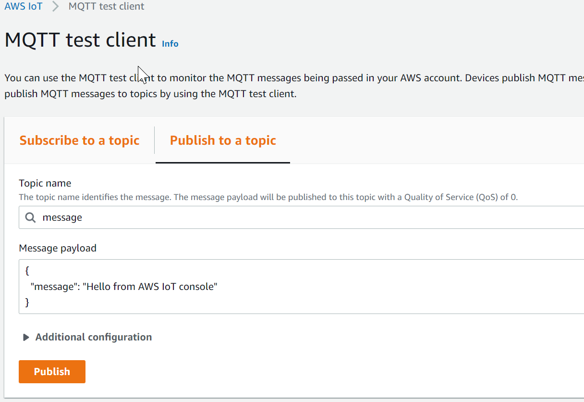

# Hello from the other side

At the moment our conversation with AWS is a little one sided. Lets subscribe to a topic.

<p align="center" style="margin-top:30px; margin-bottom:30px">
</p>

Its all in the code now!

# Subroutines for everyone
(No Oprah gif here, it looks tacky if you over use *gifs* in a presentation) 

We need two new sub routines:
1. Handles receving messages and processing them
2. Updates the LCD display

## Message handler
This is a callback function. When a message is sent to the broker that we are subscribed to, the MQTT library will call this function with the data to be processed.

We're going to do some JSON dumping here to retrieve a message from the creatively names `message` topic.

```cpp
void messageHandler(String &topic, String &payload){
  Serial.println("incoming: " + topic + " - " + payload);
  
  // Create a new temporary JSON object
  StaticJsonDocument<200> doc;
  deserializeJson(doc, payload);

  //extract the message
  const char* message = doc["message"];

  // display the message on the LCD
  displayMessage(message);
}
```

simples! 

## Display the message
This one is even easier
```cpp

void displayMessage(String message){
  // Clear the display and configure graphics properties
  tft.setTextSize(2);
  tft.fillScreen(TFT_LIGHTGREY);
  tft.setCursor(0,0,2);

  // update the lcd with the message String
  tft.print(message);
}
```
With this, we can process our messages, but how do we subscribe to a topic?

# Subscription
We need to tell our library which subroutine it should call when receiving data. Once our MQTT client has begun we can do this with the `onMessage` function
```cpp

  // define messageHandler as our call back function
  client.onMessage(messageHandler);
  ```

  However, when subscribing to a topic, we need to make sure we are connected to the broker first. So once we are connected to AWS the `subscribe` function is what we need.

  ```cpp
  // Subscribe to a topic
  client.subscribe("message");
  ```

# Testing 1..2...3...

Remember the handy dandy test tool in the AWS Console? Well we're going to crack it out again, this time to publish a message to our aptly named `message` topic.

ensure your topic name is correct, and the JSON document is formatted so your callback handler can interpret it



You should now see your display posting heartfelt messages from the cloud

<p align="center" style="margin-top:30px; margin-bottom:30px">
</p>

Although we dont want to give everyone access to our console just to send a message....